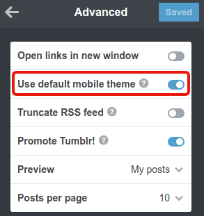
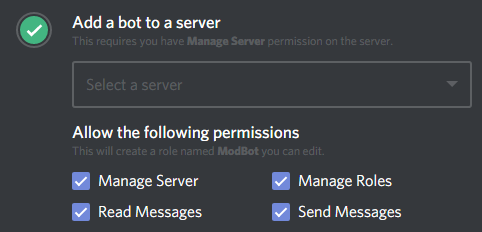

# Getting Started

Before using ModBot, make sure you have the following configured:

### Step 1: Putting your blog in mobile mode

Your blog must have the mobile verson enabled for the update process to work (though this should be fixed in the future). If you are not sure, navigate to the advanced options in your theme settings and make sure "Use default mobile theme" is enabled.

	

### Step 2: Setting proper permissions and position for the bot

When you added the bot to your server, you should have added the following permissions:

	

Please double check and ensure the bot has all of the listed permissions.

**IMPORTANT:** ModBot considers every role above it to be a mod role, so the bot's role should be moved to just below the lowest mod role on your server.

### Step 3: Configuring your server

Some of the functions require configuration